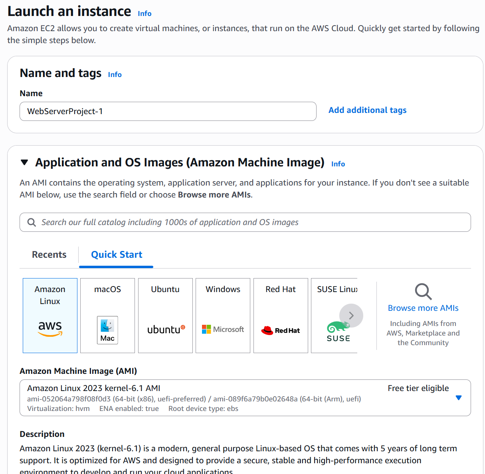
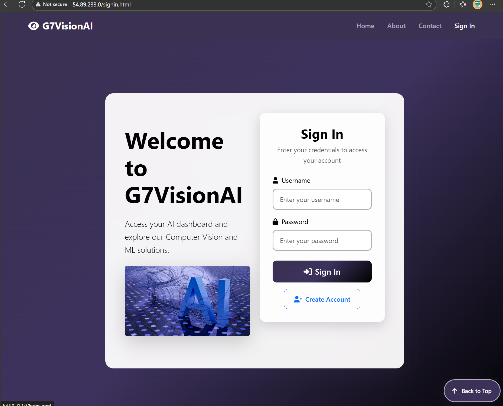

# Docker Deployment Guide AWS EC2

**Table of contents**

- [1. Build and Push Docker Image](#1-build-and-push-docker-image)
- [2. Deploy on EC2 Instance](#2-deploy-on-ec2-instance)
- [3. Access the Application](#3-access-the-application)

---

### 1. Build and Push Docker Image

1. **Create a `Dockerfile`** in the repository. Viewable [here](https://github.com/jolenele/CS651-Project1-Part2-G7VisionAI/blob/main/Dockerfile).

2. **Open Docker Desktop** and ensure `docker` commands work in your terminal.

> ### NOTE: Steps below are done in local machine.

3. **Build the Docker image:**
   ```sh
   docker build -t g7visionai:latest .
   ```

   <br><br>
   <br><br>

4. **Log in to Docker Hub:**
   ```sh
   docker login
   ```

   <br><br>

5. **Tag the image:**
   ```sh
   docker tag g7visionai:latest rohankumar09/project-1-g7visionai:latest
   ```

   <br><br>

6. **Push the image to your Docker Hub repository:**
   ```sh
   docker push rohankumar09/project-1-g7visionai:latest
   ```

   <br><br>

> Docker hub public repository.  
> Note: Repository was created on docker hub before pushing the image.
   <br><br>


---

### 2. Deploy on EC2 Instance
>    Making EC2 instance
   <br><br>

>    Adding name - everything else is default
   <br><br>

>    default t3.micro
   <br><br>

>    Using pre existing key pair  
>    you can create a new one as well.
   <br><br>

>    default network settings - for now
   <br><br>

>    launching
   <br><br>

>    launch successful
   <br><br>

>    you can view the instance in the EC2 dashboard
   <br><br>

>    upon clicking "connect" you will see ssh connection instructions
   <br><br>
   
> ### NOTE: Steps below are done in local machine We log in to EC2 instance using SSH.
>    `ls` to view key file
   <br><br>

>    using ssh command from AWS EC2 dashboard to connect to instance
>    ssh log in successful  
   <br><br>

1. **Update packages:**
   ```sh
   sudo yum update -y
   ```

>    updating packages
   <br><br>

2. **Install Docker:**
   ```sh
   sudo yum install -y docker
   ```

>    installing docker on the EC2 instance
   <br><br>

>    installation logs
   <br><br>

>    installation complete
   <br><br>

3. **Start and enable Docker:**
   ```sh
   sudo systemctl enable docker
   sudo systemctl start docker
   ```
>    starting / enabling docker service
   <br><br>
   <br><br>


4. **Pull the Docker image from Docker Hub:**
   ```sh
   sudo docker pull rohankumar09/project-1-g7visionai:latest
   ```
>    pulling docker image from my docker hub repository
   <br><br>

>    checking to ensure image is pulled
   <br><br>


5. **Run the Docker container:**
   ```sh
   docker run -d --name project1-site -p 80:80 rohankumar09/project-1-g7visionai:latest
   ```
>    running a docker container from the pulled image
   <br><br>

>    checking to ensure container is running
   <br><br>

>    we can see the instance's public ipv4 address and public dns here
   <br><br>

>    Go to this address in your browser-- but first continue on to updating security group settings  
   <br><br>

   >change security group setting
   <br><br>


6. **Update the Security Group Settings:**  
   - Add a rule to allow all outbound traffic.

   <br><br>
>    allow all outbound traffic

---

### 3. Access the Application

- Open your EC2 instance's public URL in a browser.
> Do not forget to remove the 's' from 'https' in the URL.
> it will default to https and give "unreachable address error".
   <br><br>
   <br><br>
   <br><br>
   <br><br>
   <br><br>
   <br><br>
   <br><br>
   <br><br>